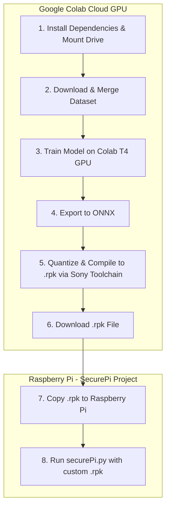

# Implementation Plan: Google Colab Workflow for Custom IMX500 Multi-Class Model

This plan provides a step-by-step **Google Colab Notebook** workflow to train, convert, and compile the custom multi-class AI model (`person`, `backpack`, `handbag`, `suitcase`, `rat`, `mouse`) on Google Colab's cloud GPU, and then deploy the resulting `.rpk` file to SecurePi on your Raspberry Pi.

---

## 🎯 Architecture & Responsibility Division



---

## 📓 Complete Google Colab Notebook Script

Open [Google Colab](https://colab.research.google.com/), create a new Notebook, set **Runtime Type** to **Python 3 with T4 GPU**, and copy each cell below:

### 📍 Cell 1: Environment Setup & GPU Check
```python
# Check GPU availability
!nvidia-smi

# Install required tools: Ultralytics YOLO, ONNX, and Sony IMX500 Converter
!pip install -q ultralytics onnx onnxruntime imx500-converter roboflow
print("✅ Environment setup complete.")
```

---

### 📍 Cell 2: Download Dataset & Configure `dataset.yaml`
```python
import os
from pathlib import Path

# Create directory structure
dataset_dir = Path("./dataset")
(dataset_dir / "images" / "train").mkdir(parents=True, exist_ok=True)
(dataset_dir / "images" / "val").mkdir(parents=True, exist_ok=True)
(dataset_dir / "labels" / "train").mkdir(parents=True, exist_ok=True)
(dataset_dir / "labels" / "val").mkdir(parents=True, exist_ok=True)

# Generate dataset configuration file
dataset_yaml = """
path: ./dataset
train: images/train
val: images/val

names:
  0: person
  1: backpack
  2: handbag
  3: suitcase
  4: rat
  5: mouse
"""

with open(dataset_dir / "dataset.yaml", "w") as f:
    f.write(dataset_yaml.strip())

print("✅ dataset.yaml generated.")
```

> **Optional Roboflow Auto-Download:**
> If using a Roboflow dataset for rodents, insert your Roboflow API key:
> ```python
> from roboflow import Roboflow
> rf = Roboflow(api_key="YOUR_ROBOFLOW_API_KEY")
> project = rf.workspace("workspace-id").project("pest-detection")
> dataset = project.version(1).download("yolov8")
> ```

---

### 📍 Cell 3: Fine-Tune Model on Colab GPU
```python
from ultralytics import YOLO

# Load lightweight YOLOv8 nano model
model = YOLO("yolov8n.pt")

# Train model for 50 epochs (takes ~15-20 minutes on Colab GPU)
results = model.train(
    data="./dataset/dataset.yaml",
    epochs=50,
    imgsz=320,              # 320x320 resolution matching IMX500 input
    batch=16,
    workers=4,
    device=0,
    name="securepi_imx500_colab",
    optimizer="AdamW",
    lr0=0.001,
    augment=True            # Brightness/contrast augmentation for IR camera views
)

print("✅ Model training finished!")
```

---

### 📍 Cell 4: Export to ONNX Format
```python
from ultralytics import YOLO

# Load fine-tuned best weights
trained_model = YOLO("runs/detect/securepi_imx500_colab/weights/best.pt")

# Export to ONNX (opset 11 for IMX500 converter compatibility)
onnx_file = trained_model.export(
    format="onnx",
    imgsz=320,
    simplify=True,
    opset=11
)

print(f"✅ ONNX model exported to: {onnx_file}")
```

---

### 📍 Cell 5: Sony IMX500 Quantization & `.rpk` Compilation
```python
# Convert ONNX to INT8 quantized .rpk firmware using Sony IMX500 Converter
!imx500-converter convert \
    --input runs/detect/securepi_imx500_colab/weights/best.onnx \
    --output imx500_custom_securepi.rpk \
    --input-shape 1 3 320 320 \
    --quantization-dataset ./dataset/images/val \
    --target-device imx500

print("🎉 Success! imx500_custom_securepi.rpk generated.")
```

---

### 📍 Cell 6: Download `.rpk` File to Your Computer
```python
from google.colab import files

# Trigger browser download of the compiled .rpk file
files.download("imx500_custom_securepi.rpk")
```

---

## 🍓 Local Raspberry Pi Deployment Steps

Once you have downloaded `imx500_custom_securepi.rpk` from Colab to your PC:

### 1. Transfer `.rpk` file to Raspberry Pi
Using SCP / WinSCP / SFTP:
```bash
scp imx500_custom_securepi.rpk pi@raspberrypi.local:/home/pi/models/
```

### 2. Run SecurePi with Custom Model
In your local `SecurePi` workspace on the Raspberry Pi:
```bash
python securePi.py \
    --model /home/pi/models/imx500_custom_securepi.rpk \
    --person-labels person \
    --bag-labels backpack handbag suitcase rat mouse \
    --unattended-time 10
```

---

## 🧪 Verification Plan

1. **Colab Execution Check:** Verify Cell 5 outputs `imx500_custom_securepi.rpk` with no conversion errors.
2. **Local Deployment Check:** Verify `securePi.py` starts without tensor shape mismatch crashes.
3. **Detection Check:** Verify both people/bags and rodent objects trigger bounding boxes with correct class names (`person`, `backpack`, `rat`, `mouse`).
